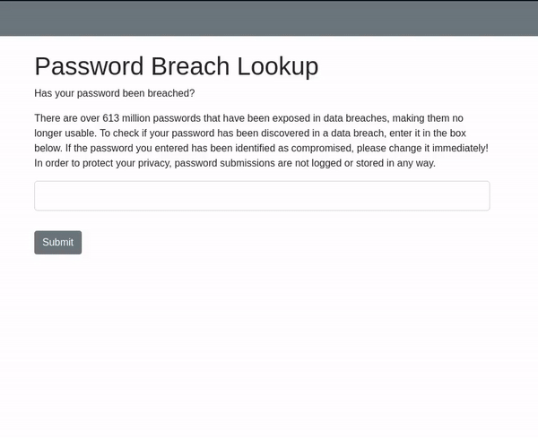

# pwncheck

## Breached password checker
pwncheck-flask is a flask app that can be deployed as web service to check the status of any passwords you have or plan to use. You could possibly deploy this on an internal web server for your users to check their passwords. It leverages the [HaveIBeenPwned](https://haveibeenpwned.com) pwndpasswords api to check the SHA1 hash of a provided password.

If pwncheck discovers the submitted password in the pwnedpasswords list, it will display a red banner letting you know how many times that password was seen in data breaches. Otherwise it will display a green banner letting you know that the password you entered has not been breached.....yet...

### Update
I added a new page and python script to generate a random password. Nothing special, but I thought it would be nice to have an option to let users generate a new password. I may add functionality to copy the password to the clipboard, but I don't know if that's necessary at this point. 

## Requirements


To install the python requests library:
```bash
pip3 install -r requirements.txt
```

## Installation
```bash
git clone https://github.com/ghsinfosec/pwncheck-flask.git
```

## Setup
You will need some sort of web engine, like nginx, setup and configured to deploy this app. Configuration of your nginx service is outside the scope of this repo. For a good reference, check out [this article](https://sinaru.com/2020/07/10/serving-flask-app-with-nginx/).
